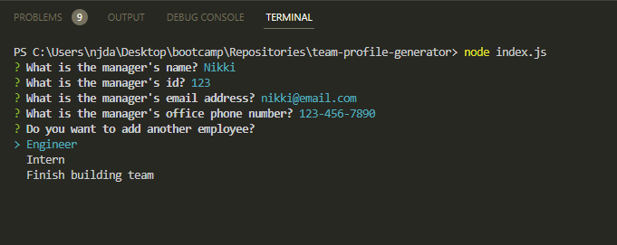
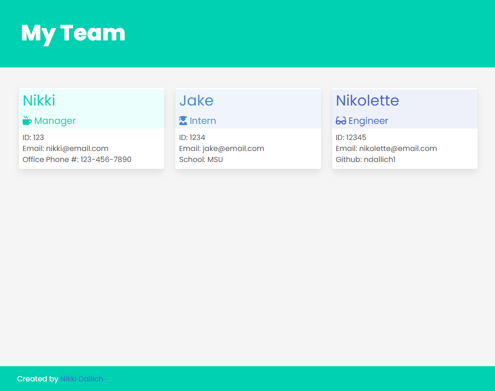
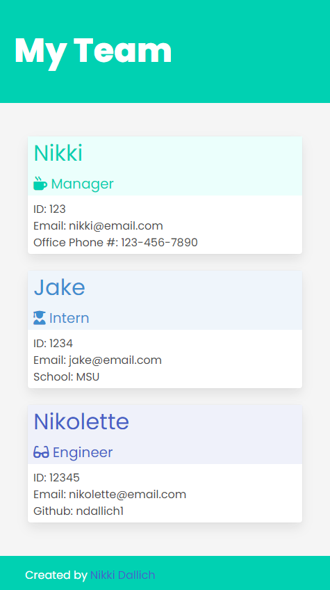

# **_team-profile-generator_**

A webpage generator for viewing team member's contact information quickly

## Table of Contents

- [Installation](#installation)
- [Usage](#usage)
- [Credits](#credits)
- [License](#license)

## Installation

1. Clone [this repository](https://github.com/ndallich1/team-profile-generator) to your terminal.
2. Type `npm i` in your terminal to install dependencies
3. Start the application in your terminal by typing `node index.js`

## Usage

Answer each prompt in the terminal to start building your team. You will start by filling out manager info, then you can add engineers and interns to your team after answering all manager questions. When you are finished adding employees to your team, select "Finish building team" and an index.html file will be created for you!

## Demo

[Watch a demo here!](https://watch.screencastify.com/v/seDj7yDkEBgA1uDbUGbt)

## Credits

Assists from the developer below:

[Nick Herman](https://github.com/nwherman1724)

## License

MIT License

Copyright 2023 Nikki Dallich

Permission is hereby granted, free of charge, to any person obtaining a copy of this software and associated documentation files (the "Software"), to deal in the Software without restriction, including without limitation the rights to use, copy, modify, merge, publish, distribute, sublicense, and/or sell copies of the Software, and to permit persons to whom the Software is furnished to do so, subject to the following conditions:

The above copyright notice and this permission notice shall be included in all copies or substantial portions of the Software.

THE SOFTWARE IS PROVIDED "AS IS", WITHOUT WARRANTY OF ANY KIND, EXPRESS OR IMPLIED, INCLUDING BUT NOT LIMITED TO THE WARRANTIES OF MERCHANTABILITY, FITNESS FOR A PARTICULAR PURPOSE AND NONINFRINGEMENT. IN NO EVENT SHALL THE AUTHORS OR COPYRIGHT HOLDERS BE LIABLE FOR ANY CLAIM, DAMAGES OR OTHER LIABILITY, WHETHER IN AN ACTION OF CONTRACT, TORT OR OTHERWISE, ARISING FROM, OUT OF OR IN CONNECTION WITH THE SOFTWARE OR THE USE OR OTHER DEALINGS IN THE SOFTWARE.

## Questions

If you have any questions, please feel free to email me at ndallich@gmail.com.

ndallich1
https://github.com/ndallich1/team-profile-generator
